# ToothMaker

ToothMaker is a graphical user interface for a computational tooth model that was created in Jernvall Lab (University of Helsinki) in 2010 for simulating triconodont tooth morphology [[1]](#References), then extended in 2014 for tribosphenic morphologies [[2]](#References) and used in later studies [[3, 4]](#References).

<center>
  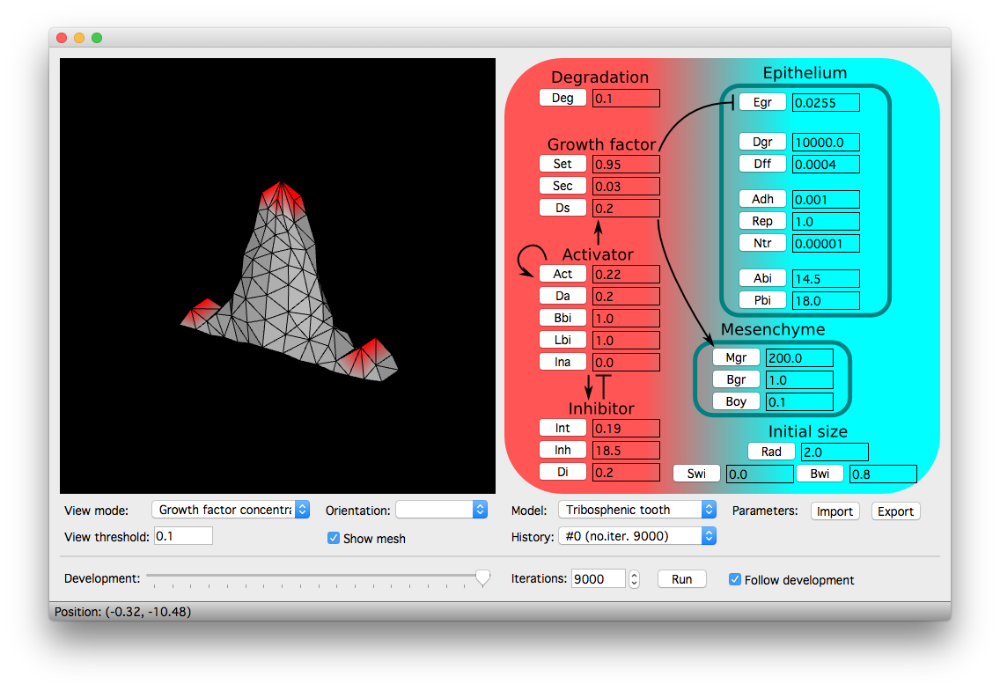
</center>

## Examples

Some example morphologies from recent studies are shown below, with links to the associated parameter files. Red color indicates the presence of a growth factor produced at the enamel knots. See References for the corresponding manuscripts for more details.

Parameter files can be imported into ToothMaker either via Import button, or by drag and drop.

### Harjumaa et al. (2014)

Mouse molar, occlusal                         | Mouse molar, lingual
:---------------------------------------------:|:-------------------------------------------:
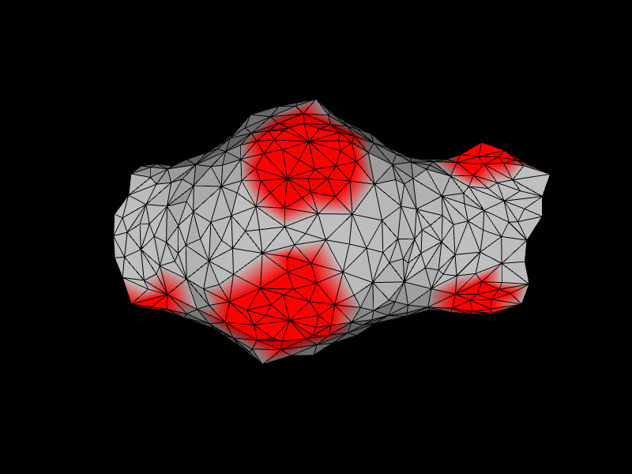 | 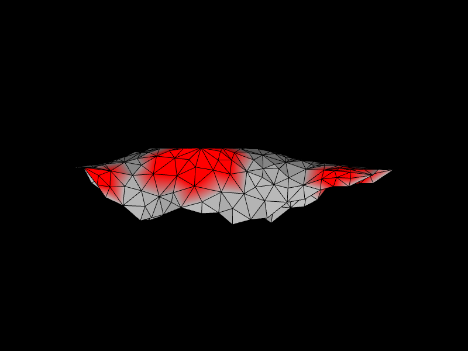

Parameters: [mouse_2014.txt](examples/mouse_2014.txt)

### Renvoisé et al. (2017)

Vole molar, occlusal                         | Vole molar, lingual
:--------------------------------------------:|:-------------------------------------------:
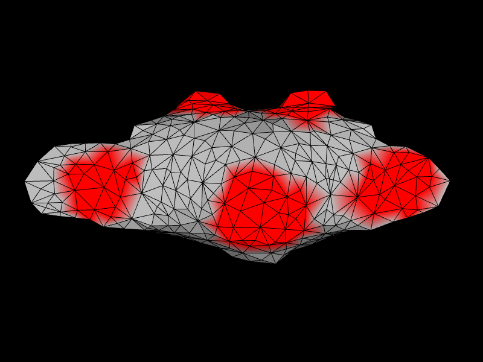 | 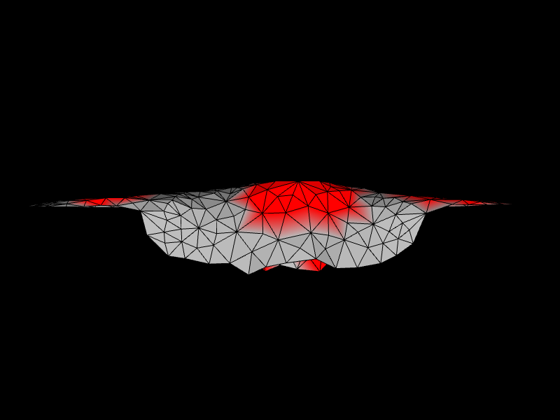

Parameters: [vole_2017.txt](examples/vole_2017.txt)

### Savriama et al. (2018, manuscript)

Ringed seal P2, occlusal                         | Ringed seal P2, lingual
:---------------------------------------------:|:-------------------------------------------:
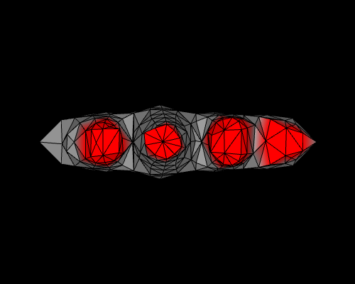 | 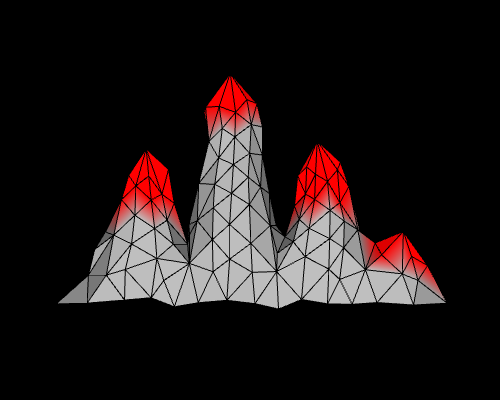

<br/><br/>

Parameters: [ringed_seal_2018.txt](examples/ringed_seal_2018.txt)

Grey seal P2, occlusal                         | Grey seal P2, lingual
:---------------------------------------------:|:-------------------------------------------:
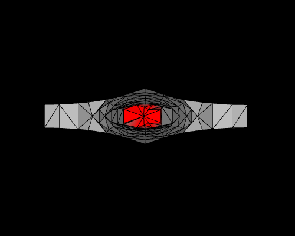 | 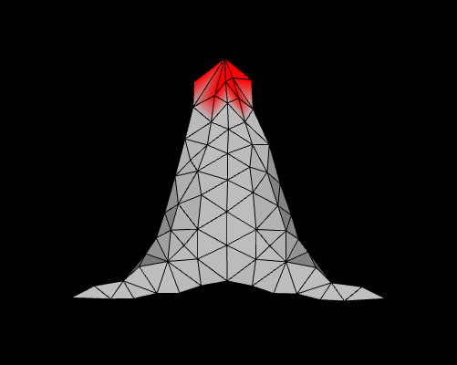

Parameters: [grey_seal_2018.txt](examples/grey_seal_2018.txt)

Hybrid P2, occlusal                         | Hybrid P2, lingual
:---------------------------------------------:|:-------------------------------------------:
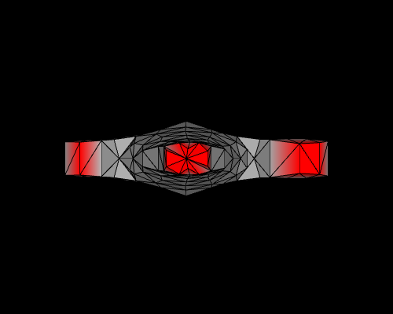 | 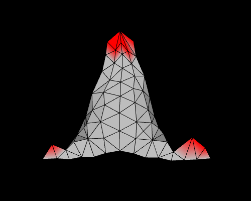

Parameters: [hybrid_2018.txt](examples/hybrid_2018.txt)

## References

[1] Salazar-Ciudad, I., Jernvall, J., 2010. A computational model of teeth and the developmental origins of morphological variation. Nature, 464(7288), p.583.

[2] Harjunmaa, E., Seidel, K., Häkkinen, T., Renvoisé, E., Corfe, I.J., Kallonen, A., Zhang, Z.Q., Evans, A.R., Mikkola, M.L., Klein, O.D. and Jernvall, J., 2014. Replaying evolutionary transitions from the dental fossil record. Nature, 512(7512), p.44.

[3] Renvoisé, E., Kavanagh, K.D., Lazzari, V., Häkkinen, T.J., Rice, R., Pantalacci, S. and Jernvall, J., 2017. Mechanical constraint from growing jaw facilitates mammalian dental diversity. Proceedings of the National Academy of Sciences, 114(35), pp.9403-9408.

[4] Savriama, Y. et al. Phenotypic limits of mammalian hybridisation (manuscript).

## Build instructions

These instructions concern only the building of ToothMaker, i.e., the interface. Pre-built 32 bit binaries of the tooth model, both 2010 'Triconodont' and 2014 'Tribosphenic' versions, are included (see [/models](models/)) and will be automatically copied when building ToothMaker. If you'd like to rebuild the Fortran code for the tooth model, see [Notes](#Notes).

The 2010 version of the model is included only for completeness. For all practical purposes, the 2014 version is a superset of the 2010 version.

### Requirements

  * Qt 5.x
  * GCC 4.8+ or Clang 3.8+ (support for C++11)
  * GLEW, GLM (included in [/ext](ext/))
  * Mac OS X 10.6 or later, Ubuntu 14.04 or later, Windows 7 or later
  * Support for OpenGL 3.0
  * Support for 32 bit binaries (see [Notes](#Notes))

### Quickstart (macOS & Linux)

Create a build folder at the root level (where `ToothMaker.pro` is), enter the
build folder and type

```shell
qmake ../ToothMaker.pro;
make;
make resources
```

If everything goes fine, the program will be placed under ./interface/ at the
build folder.

Additionally, in macOS call

```shell
macdeployqt interface/ToothMaker.app
```

to make a self-contained bundle.

### Linux

Make sure you have 32 bit binary support installed if you use the pre-built model binaries.

### Mac OS X 10.6 (Snow Leopard)

See the instructions [here](OSX106).

### Windows

Windows port hasn't been maintained for some time. Building with the standard Qt package should work, though some small changes to the code may be required (such as fixing header includes).


## Notes

* ToothMaker is a renamed fork of MorphoMaker for running the 2010/2014 tooth model only. As such, the code contains several references to MorphoMaker, and major portions of the code (like gl_modern) do nothing here. The code is part C++11, part pre-C++11, and is a patchwork of different styles. If you modify the code, it is recommended that you follow the local style of the given file in naming etc.

* The pre-built tooth model binaries are 32 bit due to reliability issues when compiled 64 bit. In case you'd like to recompile the binaries, the [G95](http://www.g95.org/) compiler is recommended. Other compilers such as GFortran have been known to cause issues.