# ToothMaker

ToothMaker is a graphical user interface for a computational tooth model that was created in Jernvall Lab (University of Helsinki) in 2010 for simulating triconodont tooth morphology [[1]](#references), then extended in 2014 for tribosphenic morphologies [[2]](#references) and used in later studies [[3-6]](#references). 

**Precompiled binaries for macOS and Linux can be downloaded from [releases](https://github.com/jernvall-lab/ToothMaker/releases).**

<p align="center">
  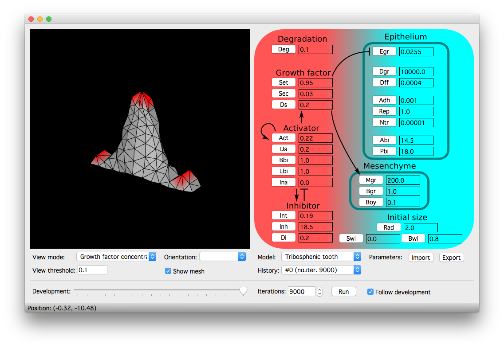
</p>

## Examples

Some example morphologies from previous studies are shown below, with links to the associated parameter files. Red color indicates the presence of a growth factor produced at the enamel knots. See References for the corresponding manuscripts for more details.

Parameter files can be imported into ToothMaker either via Import button, or by drag and drop.

### Harjumaa et al. (2014)

Mouse molar, occlusal                         | Mouse molar, lingual
:---------------------------------------------:|:-------------------------------------------:
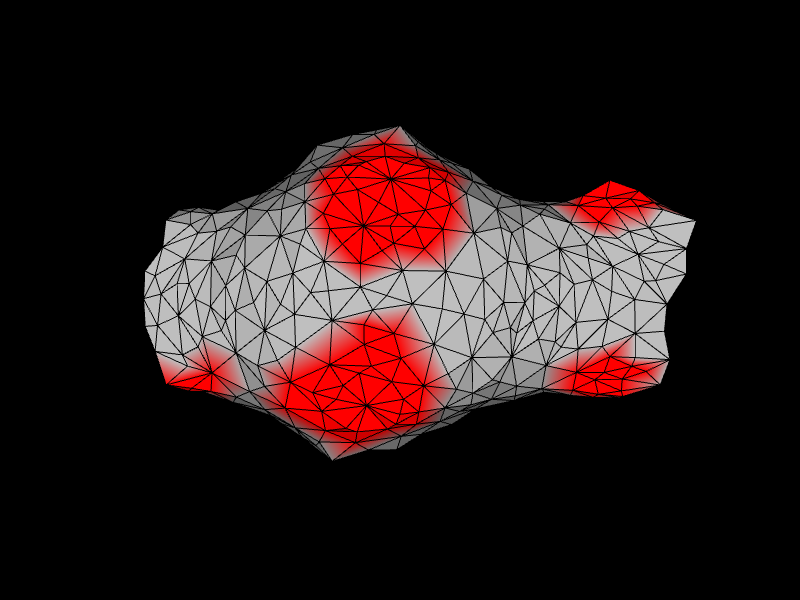 | 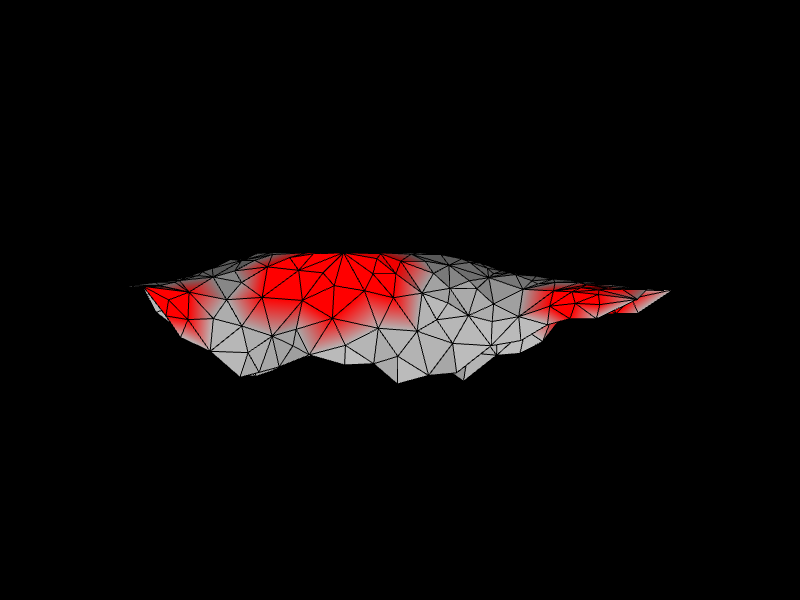

Parameters: [mouse_2014.txt](examples/mouse_2014.txt)

### Renvoisé et al. (2017)

Vole molar, occlusal                         | Vole molar, lingual
:--------------------------------------------:|:-------------------------------------------:
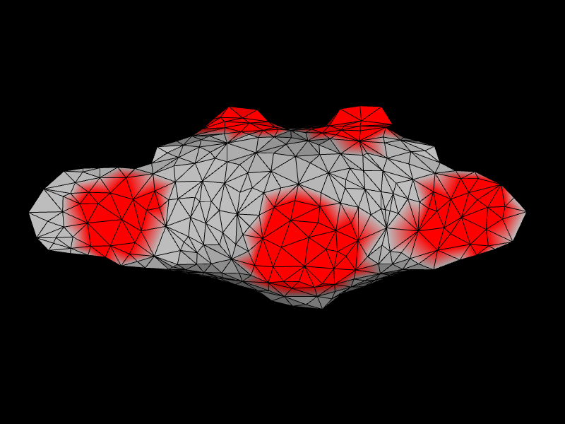 | 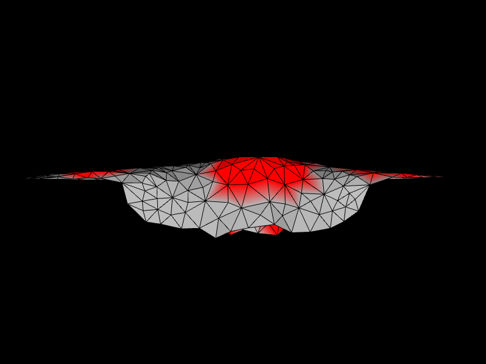

Parameters: [vole_2017.txt](examples/vole_2017.txt)

### Savriama et al. (2018)

Ringed seal P2, occlusal                         | Ringed seal P2, lingual
:---------------------------------------------:|:-------------------------------------------:
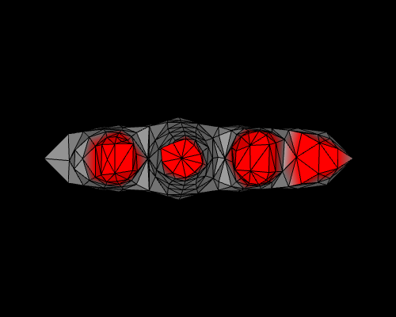 | 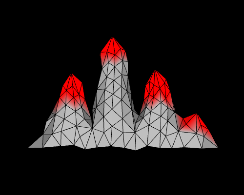

Parameters: [ringed_seal_2018.txt](examples/ringed_seal_2018.txt)

Grey seal P2, occlusal                         | Grey seal P2, lingual
:---------------------------------------------:|:-------------------------------------------:
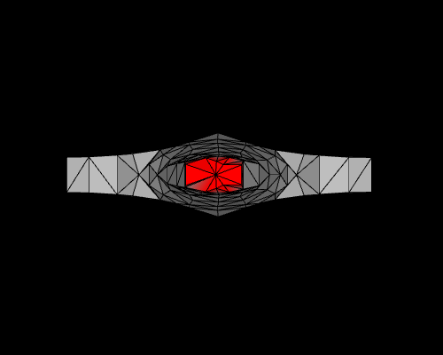 | 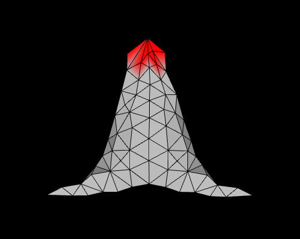

Parameters: [grey_seal_2018.txt](examples/grey_seal_2018.txt)

Hybrid P2, occlusal                         | Hybrid P2, lingual
:---------------------------------------------:|:-------------------------------------------:
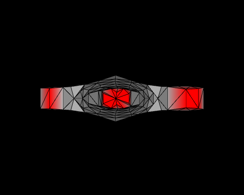 | 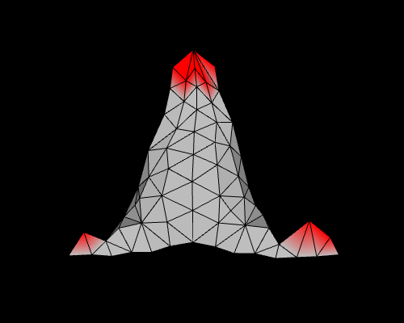

Parameters: [hybrid_2018.txt](examples/hybrid_2018.txt)

## References

[1] Salazar-Ciudad, I., Jernvall, J., 2010. A computational model of teeth and the developmental origins of morphological variation. Nature, 464, 583-586.

[2] Harjunmaa, E. et al. 2014. Replaying evolutionary transitions from the dental fossil record. Nature, 512, 44-48.

[3] Renvoisé, E. et al. 2017. Mechanical constraint from growing jaw facilitates mammalian dental diversity. Proceedings of the National Academy of Sciences, 114, 9403-9408.

[4] Savriama, Y. et al. 2018. Bracketing phenogenotypic limits of mammalian hybridization. Royal Society Open Science, 5, 180903.
http://dx.doi.org/10.1098/rsos.180903.

[5] Couzens, A. M. et al. 2021. Developmental influence on evolutionary rates and the origin of placental mammal tooth complexity. Proceedings of the National Academy of Sciences, 118(23), e2019294118.

[6] Christensen, M. M. et al. 2023. The developmental basis for scaling of mammalian tooth size. Proceedings of the National Academy of Sciences, 120(25), e2300374120.

## Build instructions

### Requirements

* Qt 5.15+ (Qt 6 not yet supported)
* GCC 7+ or Clang 5+ (C++11 support required)
* GLEW, GLM (included in [/ext](ext/))
* macOS 10.13+, Ubuntu 20.04+, or Windows 10+
* OpenGL 3.0 support

### Quickstart (macOS & Linux)

Create a build folder at the root level (where `ToothMaker.pro` is), enter the
build folder and type

```shell
qmake ../ToothMaker.pro;
make;
make resources
```

If everything goes fine, the program will be placed under ./interface/ at the
build folder.

Additionally, in macOS call

```shell
macdeployqt interface/ToothMaker.app
```

to make a self-contained bundle.

### Models

Three tooth models are included:

* **Tribosphenic tooth** - The 2014 model for tribosphenic tooth morphologies. This is a C++ translation of the original Fortran code and is the recommended version. It runs faster and produces numerically equivalent output to the Fortran version.
* **Tribosphenic tooth (Fortran/legacy)** - The original Fortran 90 implementation of the 2014 model, included for reference and validation.
* **Triconodont tooth** - The 2010 model for triconodont tooth morphologies. For most purposes, the Tribosphenic model is a superset of this model.

Model binaries are built automatically when building ToothMaker.

### Windows

Windows builds are provided via GitHub Actions but are currently untested. Building from source requires Qt 5.15, MSVC, and MinGW (for gfortran).
